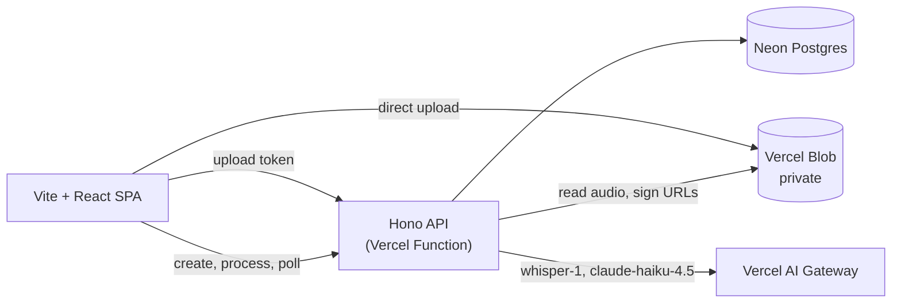

# Recap

A simplified Fireflies.ai clone: record a meeting in the browser, transcribe it with real
speech-to-text, and get topic notes, decisions and action items that link back to the moment they
were said.

- **Live app:** https://fireflies-five.vercel.app
- **Sample meeting:** https://fireflies-five.vercel.app/m/e21c9013-bb9f-46df-b23e-5debd42b1297
- **Write-up:** [docs/WRITEUP.md](docs/WRITEUP.md)

> There are no accounts. Everyone shares one public demo workspace, so don't record anything
> private.

## Try it

1. Open the sample meeting and click a highlighted timestamp. The recording plays from there and
   the transcript follows.
2. On the home page, click **Try a 2-minute sample** to run a bundled standup recording through the
   full pipeline.
3. Click **Upload audio**, or drop an audio file (WebM, M4A, MP3, WAV or OGG, up to 25 MiB) on the
   page.
4. Click **Start recording**, talk, click **Stop recording**, then **Save and transcribe**.

## Features

- **Topic notes:** sections with a gist, bold key points and sub-points. Every section, point and
  action item has a timestamp that plays the recording from that moment.
- **Player:** a sticky bar whose scrubber shows the meeting as colored topic spans with
  action-item ticks. Space plays or pauses, and `j` / `l` skip 10 s. The playing section is marked
  in the notes.
- **Transcript:** a side panel on wide screens and a tab on narrow ones, with search. It
  highlights the sentence being played.
- **Action items:** grouped by owner, with due dates. Checkboxes are saved in the browser.
- **Copy notes:** puts rich text and Markdown on the clipboard.
- **Home page:** a recorder with a live waveform, and a searchable meeting list grouped by day.
- Light and dark themes, reduced-motion support, and layouts down to 360 px.

## Architecture



- **Upload:** audio goes straight from the browser to a private Blob store. The API only issues
  the upload token.
- **Processing:** `POST /api/meetings/:id/process` runs the missing steps (transcribe, then
  summarize) in one request and saves after each step. A lease (one conditional `UPDATE`) blocks
  concurrent runs. Retry re-runs only the failed step, so a summary failure never pays for
  speech-to-text again. The page polls until the meeting is done.
- **Timestamps:** the model sees the transcript as `[Ns] text` lines. The server snaps every
  returned timestamp to a real segment start.
- **Shared contract:** `shared/schemas.ts` holds the zod schemas that both the server and the
  client validate with. The server gets its dependencies through `createApp(deps)`, so tests run
  on in-memory fakes.
- **Speech-to-text provider:** AI Gateway by default, or Groq with `STT_PROVIDER=groq`.

### API

Errors are `{ "error": { "code", "message", "retryable" } }`.

| Method | Path | Result |
|---|---|---|
| GET | `/api/health` | `{ ok, sttProvider }` |
| POST | `/api/upload` | Blob client-token exchange for `recordings/<name>.<ext>`, audio types only, ≤ 25 MiB |
| POST | `/api/meetings` | 201 meeting · 400 · 429 `rate_limited` |
| GET | `/api/meetings` | 50 newest meetings |
| GET | `/api/meetings/:id` | Meeting · 404 |
| GET | `/api/meetings/:id/audio` | `{ url, expiresAt }`: a one-hour signed URL for the recording |
| POST | `/api/meetings/:id/process` | Final meeting · 409 `already_processing` · 422 when done, not retryable or out of attempts |
| POST | `/api/meetings/:id/notes` | Rewrites a pre-notes summary as topic notes · 422 `notes_current` |
| DELETE | `/api/meetings/:id` | 204 · 404 |

## Local setup

Requires mise (Node 22), pnpm 11 and the latest Vercel CLI.

```sh
mise install && pnpm install
vercel link && vercel env pull .env.local
pnpm db:migrate
pnpm dev       # web on :5173, API on :3001
pnpm verify    # lint, typecheck, tests (what CI runs)
```

| Variable | Purpose |
|---|---|
| `DATABASE_URL`, `DATABASE_URL_UNPOOLED` | Neon, injected by the Vercel integration (the unpooled URL is for migrations) |
| `BLOB_READ_WRITE_TOKEN` | Private Blob store |
| `AI_GATEWAY_API_KEY` | Needed locally only; Vercel uses OIDC |
| `STT_PROVIDER`, `STT_MODEL`, `GROQ_API_KEY` | Speech-to-text: `gateway` (default, `openai/whisper-1`) or `groq` |
| `LLM_MODEL`, `LLM_FALLBACK_MODELS` | Default `anthropic/claude-haiku-4.5` with `google/gemini-2.5-flash` as fallback |

Other scripts:

- `pnpm smoke:ai [file]` transcribes and summarizes a file with real credentials.
- `pnpm sample:make` rebuilds the sample recording. It needs macOS `say` and ffmpeg.

## Deploy

1. Add Neon (Marketplace) and a private Blob store to the Vercel project.
2. Run `pnpm db:migrate` against the production database.
3. Run `vercel deploy --prod`, then check that `/api/health` returns JSON.

## Limits and known gaps

- One public workspace with no auth. Creating meetings is limited to 10 per hour per client and
  30 per hour in total, and processing gives up after 5 failed attempts. The upload-token endpoint
  is not rate-limited.
- Recordings are capped at 60 minutes and files at 25 MiB (the Whisper limit). Nothing is chunked.
- There is no speaker diarization and no live captions. Action-item checkboxes are saved in the
  browser only.
- Orphaned uploads are never cleaned up. The API client has no request timeout.

## Third-party tools

- **UI:** React 19, React Router, Vite, Tailwind CSS v4 (with tailwind-merge and clsx), Radix
  primitives, lucide-react, Mona Sans.
- **API and data:** Hono, zod, Drizzle ORM with the Neon serverless driver, Vercel Blob.
- **AI:** AI SDK v7 with the Vercel AI Gateway (OpenAI `whisper-1`, Anthropic
  `claude-haiku-4.5`, Google `gemini-2.5-flash`) and an optional Groq Whisper provider.
- **Tooling:** TypeScript, Biome, Vitest with Testing Library and jsdom, tsx, concurrently, dotenv,
  GitHub Actions.
- **Platform:** Vercel, including Functions, Blob and AI Gateway.
- **AI assistants:** Claude Code and ralphex (see the write-up).
