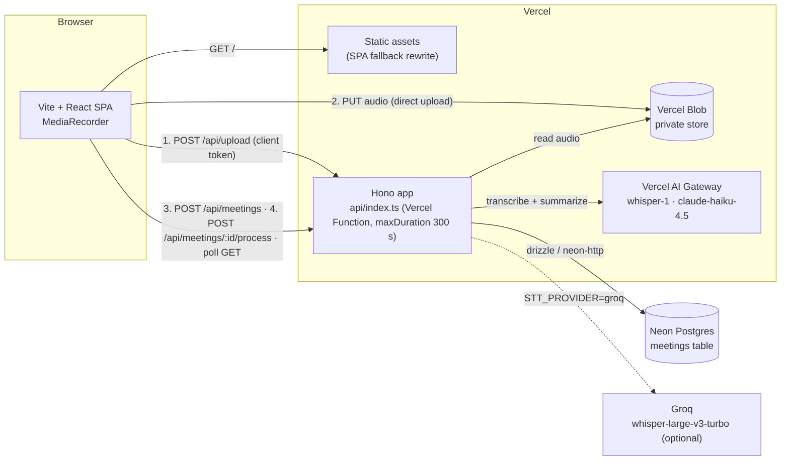
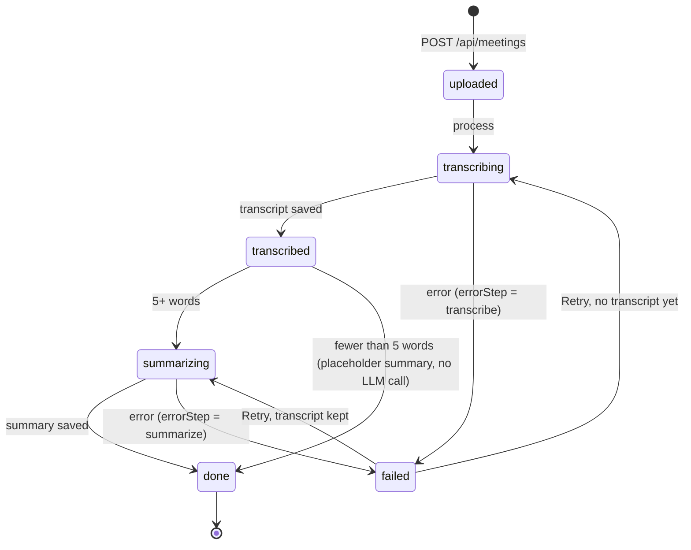

# Recap

Record a meeting in the browser, transcribe it with real speech-to-text, and get a summary with key
takeaways, decisions and action items. A simplified Fireflies.ai clone built as an engineering
take-home.

**Live:** `<LIVE_URL>` · **Write-up:** [docs/WRITEUP.md](docs/WRITEUP.md) · **Plan:**
[docs/plans/](docs/plans/)

> **Privacy notice.** There are no accounts. Everyone who opens the app shares one public demo
> workspace, so anyone can see, open and delete any meeting. Don't record anything private.

## Try it in 60 seconds

1. Open the seeded meeting: `<LIVE_URL>/m/<SEEDED_MEETING_ID>`. It shows a finished run with a
   summary, decisions, action items and a timestamped transcript.
2. On the home page, click **Try a sample**. It sends a bundled 2-minute standup recording
   (`public/samples/standup.webm`) through the same production pipeline, and the meeting page
   shows each step as it runs.
3. Click **Upload audio file** and pick a WebM, M4A, MP3, WAV or OGG file (up to 25 MiB).
4. Click **Start recording**, talk for a bit, click **Stop recording**, then **Save & transcribe**.
   This needs a microphone and a secure context (HTTPS or `localhost`).

## Architecture



- The browser uploads audio **directly to a private Blob store**. The function only mints the
  client token (`POST /api/upload`), so audio bytes never pass through a function request body.
- The API is a **Hono** app. `api/index.ts` exports the app itself, `vercel.json` rewrites
  `/api/*` to it and every other path to `index.html`. Locally, `server/dev.ts` serves the same app
  on `:3001` and Vite proxies `/api` to it.
- `shared/` holds the zod contract (`schemas.ts`), the status machine (`status.ts`) and the
  limits (`constants.ts`). The server validates with it, and the browser client (`src/lib/api.ts`)
  parses every response with it.
- The server takes its dependencies (`repo`, `storage`, `stt`, `summarize`, `now`, `log`,
  `limits`) through `createApp(deps)`. Tests use in-memory fakes; only small adapter files touch
  the SDKs, the database and Blob.

### Status machine



`stalled` is derived, never stored: a row that is neither `done` nor `failed` is stalled when its
lease is older than `LEASE_MS` (310 s, just over the 300 s function limit), or when it is past
`uploaded` without any lease. Either way the function was killed mid-run, and Retry takes over. An
`uploaded` row without a lease is not stalled; it simply hasn't been started yet.

## Pipeline, lease and resume

`POST /api/meetings/:id/process` is **synchronous and idempotent**. It runs every missing step in
one request and returns the final meeting (`done` or `failed`).

1. **Checks.** Unknown or deleted id → 404. `done` → 422 `not_processable`. A failure marked
   non-retryable (e.g. missing audio) → 422 `not_retryable`. 5 or more failed attempts → 422
   `give_up`. For the last two the UI offers **Delete and re-upload** instead of Retry.
2. **Lease.** One conditional statement claims the row:

   ```sql
   UPDATE meetings SET processing_started_at = $now, updated_at = $now
   WHERE id = $id AND deleted_at IS NULL AND status <> 'done'
     AND (processing_started_at IS NULL OR processing_started_at < $now - lease)
   RETURNING *;
   ```

   No row back → 409 `already_processing` (a second tab, or a double click). neon-http has no
   interactive transactions, so the lease is one atomic statement. When the lease is taken over
   from a run that had started (`transcribing`, `transcribed` or `summarizing`), `attempts + 1` is
   saved first, so a meeting that keeps timing out still ends in `give_up`. Every later write of
   the run, including the release, also requires `processing_started_at` to still equal its own
   `$now`. A run that outlives its lease therefore writes nothing once it has been taken over, and
   answers 409.
3. **Steps.** `nextStep()` looks at what is already saved, not at the status: no transcript →
   transcribe, no summary → summarize. Every step saves its result before the next one starts.
   - **Transcribe:** read the private blob → 25 MiB guard → `SttProvider.transcribe` → save text,
     segments, language, measured duration and provider name in one update.
   - **Short-circuit:** fewer than 5 words (counted with `Intl.Segmenter`, so CJK text counts
     correctly) → placeholder "Empty recording" summary, straight to `done`, no LLM call.
   - **Summarize:** prompt capped at 100k characters → `generateText` with `Output.object` and the
     shared zod schema (temperature 0.2, gateway fallback models). The prompt states the list
     limits (10 takeaways, 10 decisions, 20 action items). Providers don't enforce them while
     generating, so the model gets the schema without them and longer lists or a title over 120
     characters are trimmed. If the model returns an invalid object, one repair retry at
     temperature 0. The LLM title replaces the default title.
4. **Failure.** Any throw → `failed` with `errorStep`, a sanitised message (only the app's own error
   types keep their message; anything else becomes a generic string, so provider payloads never
   reach the database), `errorRetryable` and `attempts + 1`. The lease is always released, unless
   another run has taken it over.
5. **Resume.** Because artefacts persist per step, **Retry re-runs only the missing step**: a
   summarize failure never pays for speech-to-text again.

The browser drives it. After create, the submit flow sends `POST /process` without waiting for it
and navigates to `/m/:id`. The meeting page sends `process` once more only if the meeting is still
`uploaded` (e.g. the saving tab closed first); whichever request loses gets a 409, which is ignored.
If that start fails for any other reason, the page shows the error with **Retry**. The page polls
`GET /api/meetings/:id` every 2 s (every 5 s after the first minute, and on window focus) until
`done`, `failed` or `stalled`, so reloading mid-run just resumes polling. The home list re-fetches
every 5 s while a row is `transcribing`, `transcribed` or `summarizing` and not stalled. There is no
queue, cron, websocket or SSE.

### API

Every 4xx/5xx body is `{ "error": { "code", "message", "retryable" } }`.

| Method | Path | Result |
|---|---|---|
| GET | `/api/health` | 200 `{ ok: true, sttProvider }` |
| POST | `/api/upload` | Blob client-token exchange (`{ type: "blob.generate-client-token", payload: { pathname, clientPayload?, multipart? } }`). Only `recordings/<name>.<ext>`, allowed audio types, ≤ 25 MiB · 400 `validation` / `bad_pathname` / `bad_request` |
| POST | `/api/meetings` | 201 meeting (`uploaded`) · 400 `validation` / `bad_request` · 429 `rate_limited` |
| GET | `/api/meetings` | 200 list of the 50 newest meetings |
| GET | `/api/meetings/:id` | 200 meeting · 404 |
| POST | `/api/meetings/:id/process` | 200 final meeting · 404 · 409 `already_processing` · 422 `not_processable` / `not_retryable` / `give_up` |
| DELETE | `/api/meetings/:id` | 204 (blob deleted best-effort) · 404 |

`POST /api/meetings` takes `{ title?, audioPathname, contentType, sizeBytes, source,
durationSeconds? }`: `title` is trimmed, at most 120 characters, and empty means "use the summary's
title"; `audioPathname` must match the upload token rule (`recordings/<name>.<ext>`); `contentType`
is one of the allowed audio types (codec parameters are fine); `sizeBytes` is 1 to 25 MiB; `source`
is `mic`, `upload` or `demo`; `durationSeconds` is the recorder's estimate (0 to 24 h). List items
carry `id, title, status, source, durationSeconds, overviewSnippet` (first 140 characters),
`actionItemCount, stalled, createdAt, updatedAt`.

## Local setup

Requires [mise](https://mise.jdx.dev) (Node 22), pnpm 11 and the Vercel CLI (latest).

```sh
mise trust && mise install
pnpm install
vercel link                   # framework preset: Vite, output: dist
vercel env pull .env.local    # or: cp .env.example .env.local and fill it in
pnpm db:migrate               # applies drizzle/*.sql (DATABASE_URL_UNPOOLED, else DATABASE_URL)
pnpm dev                      # Vite on :5173, API on :3001 (Vite proxies /api)
pnpm verify                   # lint + typecheck + tests
```

`server/loadEnv.ts` reads `.env.local` first, then `.env`. Unit tests need no credentials.

Speech-to-text through AI Gateway is a per-team beta. Check that the team has it with
`vercel ai-gateway models list | grep -iE 'transcri|whisper'`; if not, use `STT_PROVIDER=groq`.

### Environment variables

| Variable | Required | Purpose |
|---|---|---|
| `DATABASE_URL` | yes | Neon pooled URL, used by drizzle at runtime (injected by the Neon integration) |
| `DATABASE_URL_UNPOOLED` | for migrations | Direct Neon URL for `pnpm db:migrate` |
| `BLOB_READ_WRITE_TOKEN` | yes | Private Blob store, used to mint client upload tokens and read audio |
| `AI_GATEWAY_API_KEY` | locally | AI Gateway auth. On Vercel, OIDC authenticates automatically; locally the `VERCEL_OIDC_TOKEN` from `vercel env pull` also works until it expires |
| `STT_PROVIDER` | no | `gateway` (default) or `groq` |
| `STT_MODEL` | no | Gateway transcription model, default `openai/whisper-1` |
| `GROQ_API_KEY` | if `groq` | Groq API key (free tier) |
| `LLM_MODEL` | no | Summary model, default `anthropic/claude-haiku-4.5` |
| `LLM_FALLBACK_MODELS` | no | Comma-separated gateway fallbacks, default `google/gemini-2.5-flash` |
| `TEST_DATABASE_URL` | no | Dev only: runs the `drizzleRepo` contract tests. Vitest doesn't read `.env.local`, so pass it on the command line (`TEST_DATABASE_URL=postgres://… pnpm test`). Use a throwaway, already migrated database: the suite deletes every row in `meetings` |

### Scripts

| Script | What it does |
|---|---|
| `pnpm dev` | Vite dev server and the API (`tsx watch server/dev.ts`) side by side |
| `pnpm build` | Production SPA build into `dist/` |
| `pnpm typecheck` | `tsc` for the browser (`tsconfig.json`) and the server (`tsconfig.server.json`) |
| `pnpm test` / `pnpm test:watch` | Vitest, `client` (jsdom) and `server` (node) projects |
| `pnpm lint` / `pnpm format` | Biome check / Biome check with fixes |
| `pnpm verify` | lint + typecheck + test (what CI runs) |
| `pnpm db:generate` / `pnpm db:migrate` | drizzle-kit migration generation / apply |
| `pnpm smoke:ai [file]` | Transcribes and summarizes a file (default: the bundled sample) with real credentials, prints JSON |
| `pnpm sample:make` | Rebuilds `public/samples/standup.webm` from `docs/sample-script.md`. Needs macOS `say` with the Samantha, Daniel and Karen voices, and ffmpeg (with libopus) plus ffprobe; fails if the result is over 1 MiB |

Coverage: `pnpm vitest run --coverage --project server`.

## Deploy

1. Use the latest Vercel CLI (`pnpm add -g vercel@latest`). A local `vercel build` with CLI 50.x
   couldn't parse pnpm 11's lockfile, fell back to npm and failed.
2. `vercel link`, then in the dashboard add **Neon** (Marketplace) and a **private Blob** store to
   the project. They inject `DATABASE_URL`, `DATABASE_URL_UNPOOLED` and `BLOB_READ_WRITE_TOKEN`.
3. Set `STT_PROVIDER` (plus `STT_MODEL` or `GROQ_API_KEY`), `LLM_MODEL` and `LLM_FALLBACK_MODELS`
   in the project env. The AI Gateway uses OIDC on Vercel, so no key is needed there.
4. Migrate the production database. `vercel env pull` fills `.env.local` from the Development
   environment by default, so pass the production direct URL explicitly (shell variables win over
   `.env.local`): `DATABASE_URL_UNPOOLED='<production direct URL>' pnpm db:migrate`.
5. `vercel deploy --prod`. `vercel.json` runs `pnpm typecheck && pnpm build`, serves `dist/`, and
   sets `maxDuration` 300 on `api/index.ts`. In the build log, check that pnpm 11 was picked. A
   `TS2688 … 'vite/client'` line from the function build is harmless; the build still succeeds, and
   `pnpm typecheck` does the real type check.
6. Smoke test: `curl -i <LIVE_URL>/api/health` must return JSON with the expected `sttProvider`
   (not `index.html`, and not the 404 envelope). Then run the checklist in
   [docs/WRITEUP.md](docs/WRITEUP.md#production-smoke-checklist).

CI (`.github/workflows/ci.yml`) runs lint, typecheck and tests on pushes to `main` and on pull
requests.

## Abuse limits

- `POST /api/meetings` is rate-limited by counting rows already created: 10 per hour per client
  (SHA-256 of the first `x-forwarded-for` hop) and 30 per hour in total, so the 11th create from one
  client and the 31st overall are refused. The limits are constants in `server/index.ts`. Locally,
  requests without `x-forwarded-for` share one bucket. Over the limit it returns 429
  `rate_limited` with `Retry-After: 3600` (the limiter only counts, so it reports the whole
  window).
- Deleting a meeting is a soft delete: the row stays, with its title, transcript and summary
  wiped, so deleted meetings still count and a create/delete loop can't get around the limit.
- The Blob token endpoint (`POST /api/upload`) is **not** rate-limited: the Blob client discards
  error bodies, so a 429 there would reach users as an unreadable failure. Orphan uploads (uploaded
  but never created) are bounded only by the Blob store quota (1 GB on Hobby) and 25 MiB per file.
- Upload tokens are only issued for flat `recordings/<name>.<ext>` paths and the allowed audio
  types, and `POST /api/meetings` accepts only such paths, so a meeting can't point at (or delete)
  a blob outside `recordings/`. It can still point at another meeting's recording.
- Processing gives up after 5 failed attempts per meeting, so a broken file can't keep paying for
  speech-to-text.

## Assumptions

- A single shared workspace with no auth, users or sharing.
- Recordings are capped at 60 minutes (warning at 55) and files at 25 MiB, the upstream Whisper
  limit. Nothing is chunked.
- The summary prompt is written in English and asks the model to keep the transcript's language.
  English is the tested path.
- Speech-to-text through AI Gateway is a per-team beta. If `openai/whisper-1` isn't available to
  the team, set `STT_PROVIDER=groq`.
- One request is enough to process a meeting: speech-to-text plus a summary of a 60-minute
  recording is expected to fit in the 300 s function limit. A run killed at the limit shows as
  stalled and resumes on Retry.

## Known limitations and cuts

- No speaker diarization (the gateway and Groq Whisper don't return speakers), no live captions,
  no audio playback (blobs are private), no title editing.
- No orphan-blob cleanup, and no rate limit on the upload token endpoint (see above).
- The API client has no fetch timeout, so a hung `GET` stops polling until the page is reloaded.
- The rate limit counts, then inserts, in two statements. Parallel creates from one client can
  overshoot it by the number of requests in flight. Per-client means per address, so an IPv6
  client with many addresses gets more. A Vercel Firewall rule is the next step.
- Deleted rows are kept for the rate limit and never purged.
- If a create succeeds but its response is lost, Retry creates a second meeting for the same
  recording. Deleting either one deletes the shared audio, so the other fails with
  `audio_missing` if it hasn't been transcribed yet. A unique index on `audio_pathname` would fix
  this.
- An `uploaded` meeting whose start request never arrived waits until someone opens it; the home
  list doesn't poll for it.
- A connection dropped while a response body is read surfaces as a non-retryable `bad_response`.
- When `navigator.mediaDevices` exists but `getUserMedia` does not, the recorder shows
  "unavailable" instead of "unsupported".
- `drizzleRepo` is not exercised in CI: the repo contract suite runs against Postgres only when
  `TEST_DATABASE_URL` is set. `blobStorage` is tested against a mocked `@vercel/blob` only.
- The client bundle is just over Vite's 500 kB warning, mostly the `@vercel/blob` client.
- Also cut: job queue, cron, SSE, Playwright E2E, Storybook, dark mode, i18n. The full list is in
  the plan's "Explicitly out of scope" section.

## Third-party tools

| Tool | Purpose |
|---|---|
| react, react-dom | UI |
| react-router (v8) | Client routing (`createBrowserRouter`) |
| vite, @vitejs/plugin-react | Dev server and production build |
| typescript, @types/node, @types/react, @types/react-dom | Types (TypeScript 7) |
| tailwindcss, @tailwindcss/vite | Styling (Tailwind v4) |
| tailwind-merge, clsx | `tw()` class merging with the app's custom text scale (`src/twMerge.ts`) |
| @radix-ui/react-slot | `asChild` support in the unstyled `Button` |
| hono | API framework, runs on Vercel Functions and Node |
| @hono/node-server | Local API server (`server/dev.ts`) |
| @hono/zod-validator | Request validation with the shared zod schemas |
| zod (v4) | Shared API contract, env parsing, LLM output schema |
| ai (AI SDK v7) | `transcribe()` and `generateText()` with `Output.object` |
| @ai-sdk/gateway | Vercel AI Gateway transcription model |
| @ai-sdk/groq | Groq Whisper fallback provider |
| @vercel/blob | Private Blob storage: client upload, token exchange, read, delete |
| drizzle-orm, drizzle-kit | Postgres schema, queries and migrations |
| @neondatabase/serverless | Neon HTTP driver |
| dotenv | Loads `.env.local` / `.env` locally |
| tsx | Runs the local API and scripts |
| concurrently | Runs Vite and the API together in `pnpm dev` |
| @biomejs/biome | Lint and format |
| vitest, @vitest/coverage-v8 | Unit tests and coverage |
| jsdom | Browser environment for client tests |
| @testing-library/react, @testing-library/dom, @testing-library/jest-dom, @testing-library/user-event | Component and hook tests |
| Vercel CLI | Linking, env pull, local build, deploy |
| macOS `say`, ffmpeg (libopus) | Dev only: generates the sample recording |
| Vercel (static hosting + Functions), Vercel Blob, Vercel AI Gateway | Hosting, storage, speech-to-text and LLM access |
| Neon Postgres (Vercel Marketplace) | Database |
| OpenAI `whisper-1`, Groq `whisper-large-v3-turbo` | Speech-to-text models |
| Anthropic `claude-haiku-4.5`, Google `gemini-2.5-flash` | Summary model and its gateway fallback |
| GitHub Actions | CI |
| mise, pnpm | Node version and package management |
| Claude Code, ralphex | AI-assisted implementation (see the write-up) |
